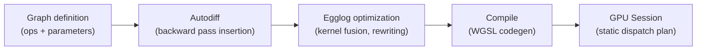

Meganeura is a Rust library for training and running neural networks on any GPU — from laptops to edge devices — without CUDA dependencies. You define models as declarative computation graphs. Meganeura then runs automatic differentiation, optimizes the graph with equality saturation, and compiles it to a static GPU dispatch sequence. There is no JIT warmup and no manual kernel scheduling.

## Why Meganeura?

**Portable.** Meganeura uses [blade-graphics](https://github.com/kvark/blade/tree/main/blade-graphics) to target GPUs across Linux, Windows, macOS, iOS, and Android through Vulkan and Metal. You write one model definition and it runs everywhere.

**Zero compile-time execution.** The execution plan is compiled once when you call `build_session`. From that point on, every forward and backward pass runs as a fixed sequence of GPU dispatches — no recompilation, no tracing overhead.

**E-graph optimized.** During compilation, Meganeura explores the search space of equivalent kernel combinations using [egglog](https://github.com/egraphs-good/egglog) equality saturation — the same technique used by [Luminal](https://github.com/luminal-ai/luminal). Operations like matmul+bias, SwiGLU, and RmsNorm are automatically fused without any manual annotation.

**HuggingFace integration.** Load safetensors weights directly from the HuggingFace Hub. The `SafeTensorsModel` API downloads and maps weights to your graph parameters with a single call.

**Built-in transformer primitives.** The `nn` module ships with layers for multi-head attention (including grouped query attention), RoPE positional encoding, RmsNorm, SwiGLU, and more — everything you need to run or fine-tune modern architectures.

## Architecture overview

A model moves through four stages from definition to GPU execution:

1. **Graph** — You build a model as a `Graph` of typed tensor operations: `matmul`, `bias_add`, `relu`, `cross_entropy_loss`, and so on. Parameters and inputs are named nodes.
2. **Autodiff** — `build_session` automatically extends the graph with backward-pass operations for every trainable parameter using reverse-mode automatic differentiation.
3. **Egglog optimization** — The extended graph is passed to an e-graph rewriting engine. It searches for equivalent programs with fewer or cheaper operations and fuses compatible kernels.
4. **Compile** — The optimized graph is lowered to WGSL shaders and compiled to GPU-native code via blade-graphics. The result is a fixed list of buffer allocations and compute dispatches.
5. **Session** — At runtime, `Session` holds the GPU buffers and executes the dispatch plan. You set inputs and parameters, call `step()`, and read outputs.

## Key capabilities

- **Training** — Full gradient descent training with `Trainer` and `TrainConfig`. Supports SGD and configurable learning rates out of the box.
- **Inference** — Build read-only sessions with `build_inference_session` for faster, memory-efficient forward-only execution.
- **HuggingFace Hub** — Download and load safetensors models directly with `SafeTensorsModel::download`.
- **Built-in models** — Pre-built graph definitions for SmolLM2, SmolVLM2, and Stable Diffusion UNet.
- **Profiling** — Emit binary Perfetto traces with `MEGANEURA_TRACE=<path>` for detailed GPU timeline analysis.

## Get started

<CardGroup cols={2}>
  <Card title="Quickstart" icon="rocket" href="/quickstart">
    Train a two-layer MLP on MNIST in under five minutes with the complete working example.
  </Card>
  <Card title="System requirements" icon="microchip" href="/system-requirements">
    Check supported GPUs, drivers, and platforms before you start.
  </Card>
  <Card title="Concepts" icon="brain" href="/concepts/computation-graph">
    Understand how computation graphs, autodiff, and e-graph optimization work together.
  </Card>
  <Card title="API reference" icon="code" href="/api/graph">
    Full reference for `Graph`, `Session`, `Trainer`, and all neural network layers.
  </Card>
</CardGroup>
